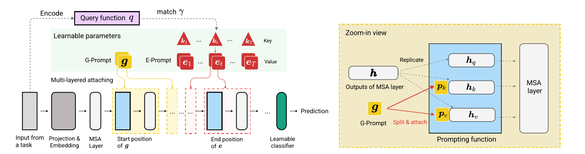
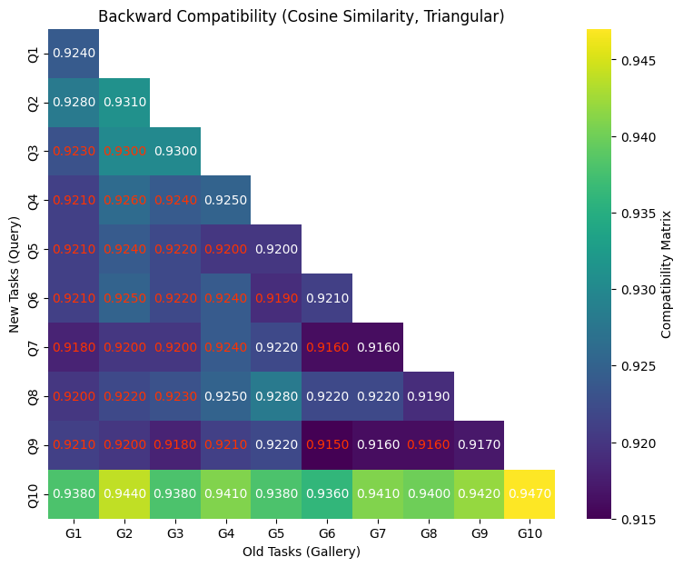
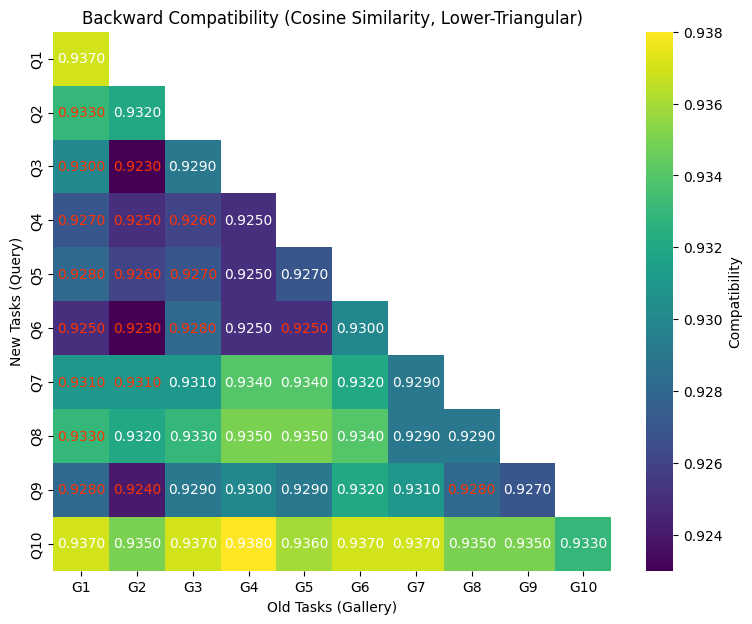
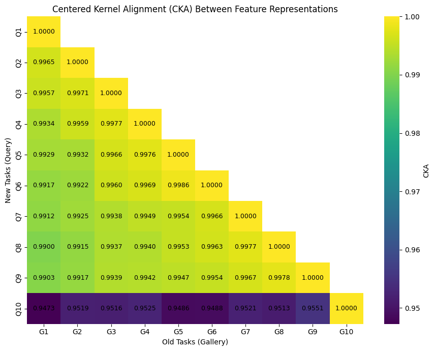
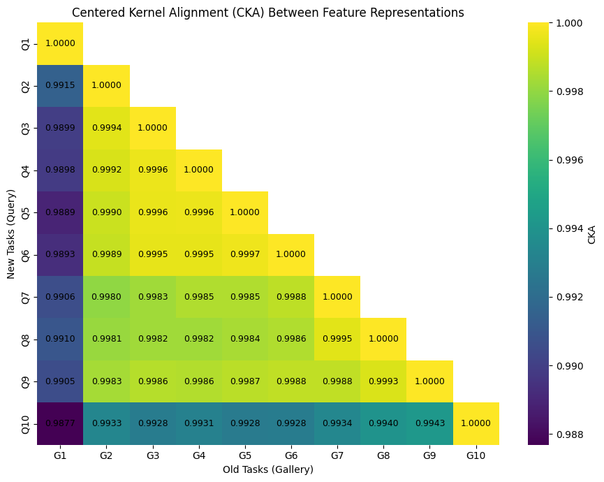

<div align="center">

<h1>DualPrompt: Rehearsal-Free Continual Learning<br>and Backward-Compatible Representations</h1>

An analysis of the **backward compatibility** of feature representations learned by DualPrompt on a frozen ViT backbone, using a query–gallery protocol, feature-level distillation, out-of-distribution evaluation and representation similarity (CKA, PCA, t-SNE).

[](https://colab.research.google.com/github/digesaremarco/DualPrompt_and_BackCompability/blob/master/DualPrompt.ipynb)
[](https://www.python.org/)
[](https://pytorch.org/)
[](Report.pdf)

</div>

---

## Overview



> **Wang et al. (2022)**
> *DualPrompt: Complementary Prompting for Rehearsal-Free Continual Learning*, ECCV 2022 — [arXiv:2204.04799](https://arxiv.org/abs/2204.04799)

Continual learning methods are usually evaluated on accuracy and forgetting. In many real-world systems, however, embeddings extracted by a model are stored and reused over time (e.g. retrieval or biometric databases), and re-encoding the whole gallery after every model update is impractical. In these settings, the new model must produce features that remain **compatible** with those produced by earlier versions.

This project studies the backward compatibility of **DualPrompt**, a rehearsal-free continual learning method that keeps a pre-trained **ViT-B/16** frozen and learns two kinds of prompts:

| Prompt | Role | Shared across tasks? |
|---|---|:---:|
| **G-Prompt** (General) | Captures task-invariant knowledge | Yes |
| **E-Prompt** (Expert) | Captures task-specific knowledge, selected at inference via a learnable task key | No |

Compatibility is evaluated without re-encoding the gallery, and the evolution of the feature space is analyzed across tasks.

---

## Method

### DualPrompt with Prefix Tuning

Prompts are injected with **Prefix Tuning**: a prompt `p` is split into key and value parts `p_K, p_V ∈ R^{(L_p/2) × D}` and prepended to the keys and values of the multi-head self-attention, leaving the queries unchanged:

$$
f^{\text{Pre-T}}_{\text{prompt}}(p, h) = \text{MSA}\big(h_Q,\; [p_K; h_K],\; [p_V; h_V]\big)
$$

This preserves the original sequence length. For a sample `x` of task `t`, the training objective is:

$$
\min_{v_g,\, v_e^{(t)},\, k_t,\, \phi} \; \mathcal{L}_{CE}\big(f_\phi(f_{v_g, v_e^{(t)}}(x)),\, y\big) \; + \; \lambda \, \mathcal{L}_{\text{match}}(x, k_t)
$$

where `v_g` is the G-Prompt, `v_e^(t)` the E-Prompt of task `t`, `k_t` its task key and `φ` the classification head. The query function is the `[CLS]` embedding of the frozen backbone, `q(x) = f(x)[0]`, and at inference the expert prompt is selected as:

$$
t^* = \arg\max_{t} \; \cos\big(q(x),\, k_t\big)
$$

Only prompts, task keys and the classification head are trained.

### Backward compatibility protocol

Following Shen et al. (2020), a new model `φ_new` is considered empirically backward compatible with an old model `φ_old` if:

$$
M(\phi_{\text{new}}, \phi_{\text{old}};\, Q, D) \; \ge \; M(\phi_{\text{old}}, \phi_{\text{old}};\, Q, D)
$$

where `M` is evaluated with queries encoded by the first model and a gallery encoded by the second.

In practice, after each training stage the **CIFAR-10 test set** is used as a fixed benchmark:

1. **Gallery**: encoded with the model after task `t_g`. Token features are mean-pooled and ℓ2-normalized.
2. **Query**: the same samples encoded with the model after task `t_q ≥ t_g`.
3. **Matching**: cosine similarity between queries and the stored gallery, followed by **k-NN classification (K = 5)** by majority vote.
4. **Aggregation**: the accuracies fill a **lower-triangular compatibility matrix** `C[t_q, t_g]`. Diagonal entries are standard same-model evaluation, off-diagonal entries measure backward compatibility.

### Feature alignment via distillation

An optional loss aligns the embeddings of the current model with those of the frozen model from the previous task, in the spirit of Learning without Forgetting:

$$
\mathcal{L} = \mathcal{L}_{CE} + \lambda \left(1 - \frac{f_{\text{new}} \cdot f_{\text{old}}}{\lVert f_{\text{new}} \rVert \, \lVert f_{\text{old}} \rVert}\right)
$$

### Representation similarity

Similarity between embedding spaces at different stages is measured with linear **Centered Kernel Alignment** (Kornblith et al., 2019), computed on centered features:

$$
\text{CKA}(X, Y) = \frac{\lVert Y^\top X \rVert_F^2}{\lVert X^\top X \rVert_F \; \lVert Y^\top Y \rVert_F}
$$

PCA and t-SNE projections are also computed after each task for qualitative inspection.

---

## Experiments

| # | Setting | Goal |
|---|---|---|
| 1 | **Baseline DualPrompt**, CIFAR-100, 10 tasks × 10 classes | Reference backward compatibility |
| 2 | **Feature alignment via distillation** | Reduce embedding drift across tasks |
| 3 | **Out-of-distribution evaluation**, query and gallery from BloodMNIST | Robustness under distribution shift |
| 4 | **5 tasks × 20 classes** | Effect of coarser task granularity |

---

## Results

<div align="center">

| Setting | k-NN compatibility (off-diagonal) | Compatible pairs¹ | CKA, tasks 1 … T−1 | CKA, last task |
|---|:---:|:---:|:---:|:---:|
| Baseline (10 × 10) | 0.92 – 0.94 | 37% | > 0.99 | ~0.95 |
| + Feature distillation | 0.92 – 0.94 | 57.8% | ≈ 0.99 | ≈ 0.99 |
| OOD (BloodMNIST) | 0.87 avg. (last task 0.79 – 0.80) | 31% | ≈ 0.99 | ~0.80 |
| 5 × 20 split | 0.92 – 0.93 | 8 / 10 pairs | ≈ 0.99 | ≈ 0.99 |

</div>

¹ Off-diagonal pairs satisfying `M(φ_new, φ_old) ≥ M(φ_old, φ_old)`. The 10 × 10 settings have 45 pairs, the 5 × 20 split only 10, so the last row is not directly comparable with the others.

**Backward compatibility matrices**: baseline (left) vs. feature distillation (right). Red entries mark pairs where compatibility is not maintained.

<p align="center">
  
  
</p>

**CKA heatmaps**: baseline (left) vs. feature distillation (right).

<p align="center">
  
  
</p>

---

## Key Observations

- **The baseline is already highly compatible.** Without any alignment loss, k-NN accuracy with an old gallery stays around 0.92–0.94, very close to same-model evaluation.
- **Distillation improves consistency, not absolute accuracy.** Off-diagonal values are in the same range as the baseline, but the share of compatible pairs rises from 37% to 57.8%, and the last task stays aligned with earlier ones (CKA ≈ 0.99 vs. ~0.95).
- **Distribution shift is the hardest case.** On BloodMNIST, compatibility drops to 0.87 on average and to about 0.80 for the last task, where CKA also falls to ~0.80. Earlier tasks remain well aligned.
- **Task granularity has little effect.** With 5 tasks of 20 classes, compatibility stays at 0.92–0.93 and CKA around 0.99.
- **PCA and t-SNE should be read with care.** Projections are fitted independently after each task, so changes in orientation between plots may be artifacts of the projection rather than real drift. CKA and cross-model k-NN are the reliable indicators.
- **A possible explanation for the stability** is that prompts act on intermediate self-attention layers of a frozen backbone, modulating attention rather than rewriting the representation space. This remains a hypothesis and is not tested directly.

---

## Quick Start

```bash
git clone https://github.com/digesaremarco/DualPrompt_and_BackCompability.git
cd DualPrompt_and_BackCompability
```

Open `DualPrompt.ipynb` in Jupyter or Colab and run the cells in order to:

1. Train DualPrompt on CIFAR-100.
2. Build query–gallery embeddings and compute the compatibility matrices.
3. Visualize feature evolution with PCA, t-SNE and CKA.
4. Run the distillation, OOD and 5-task experiments.

The full analysis is in [Report.pdf](Report.pdf).

---

## References

- Z. Wang et al., *DualPrompt: Complementary Prompting for Rehearsal-Free Continual Learning*, ECCV 2022. [arXiv:2204.04799](https://arxiv.org/abs/2204.04799)
- Y. Shen, Y. Xiong, W. Xia, S. Soatto, *Towards Backward-Compatible Representation Learning*, CVPR 2020. [arXiv:2003.11942](https://arxiv.org/abs/2003.11942)
- Z. Li, D. Hoiem, *Learning without Forgetting*, TPAMI 2017. [arXiv:1606.09282](https://arxiv.org/abs/1606.09282)
- S. Kornblith, M. Norouzi, H. Lee, G. Hinton, *Similarity of Neural Network Representations Revisited*, ICML 2019. [arXiv:1905.00414](https://arxiv.org/abs/1905.00414)
- N. Biondi, F. Pernici, M. Bruni, A. Del Bimbo, *CoReS: Compatible Representations via Stationarity*, TPAMI 2023.

---

<div align="center">

Made by [Marco Di Gesare](https://github.com/digesaremarco)

</div>